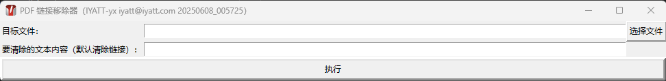

# pdf-link-remover PDF 链接移除器

2025.5.19  
从某网站下载的国标文件被添加了超链接，在页面任意位置点击都会触发跳转，很烦人。  
这个网站添加的超链接不是PDF注释、链接、表单等形式存在，用 Acrobat 查看可以发现页面上布满了一堆透明矩形框，这个矩形框中有隐藏的文字，文字内容就是链接。链接数量巨多，文件页数如果比较多的话，手动删除非常麻烦。今天突然想较劲一下，找到了可以筛选删除它的方案，下班后晚上就写了这个简易的工具。  
  

目标文件：可以一次性选择一个或多个文件，手动输入的话，文件之间使用 | 作为分隔符。  
要清除的文本内容：PDF 对象流中包含的指定文本会被删除。留空的话，默认遍历所有对象流的文本，检查文本是否为链接，是链接则删除链接部分。  
输出文件：新输出的文件是在源文件名后加上 .pdf。比如原文件是“C:\test.pdf”，处理后输出文件就是“C:\test.pdf.pdf”  

## 测试环境

Python 3.13.1  

适用于 Windows 8 及以上  